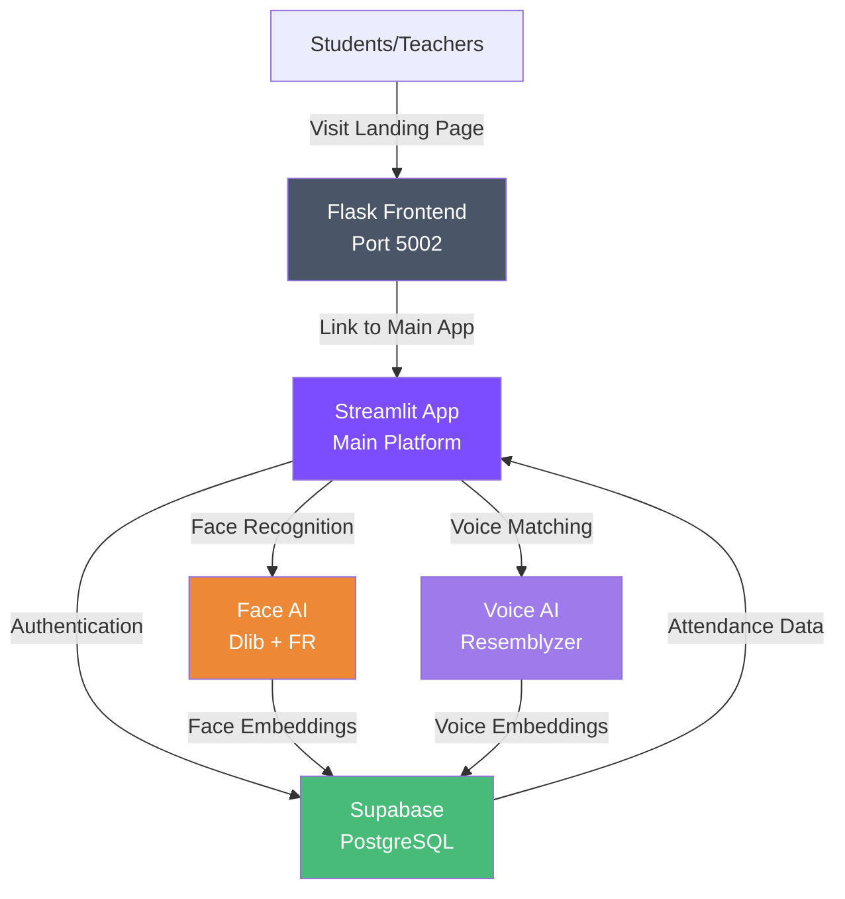

# 📷 Present.ly - AI-Powered Attendance Management System

> **Revolutionizing classroom attendance with next-gen computer vision and voice biometrics**

[](https://www.python.org/)
[](https://flask.palletsprojects.com/)
[](LICENSE)
[]()

---

## 🎯 Overview

Present.ly is a modern **AI-powered attendance management system** designed to eliminate manual roll calls and make attendance tracking fast, secure, and seamless. This repository contains the **frontend landing page** and marketing interface for the Present.ly ecosystem.

**The Problem:** Traditional attendance systems are time-consuming, error-prone, and lack security. Teachers spend valuable class time taking attendance while students can mark proxies.

**The Solution:** Present.ly uses advanced computer vision and voice biometrics to automatically identify and verify students in seconds—making attendance foolproof and frictionless.

### 📱 Full Platform Architecture
- **This Repo:** Flask landing page + marketing website (running on port 5002)
- **Main Application:** Streamlit-powered interactive platform → [Live Demo](https://presently-main.streamlit.app/)
- **Backend:** Supabase cloud infrastructure with PostgreSQL + authentication
- **AI Engine:** Face recognition, voice embeddings, and biometric matching

---

## ✨ Key Features

| Feature | Description |
|---------|-------------|
| 📷 **AI Face Analysis** | Advanced neural networks recognize students from a single class photo in milliseconds. Delivers accuracy and speed that manual attendance cannot match. |
| 🎙️ **Sequential Voice ID** | Students speak "Present" one-by-one, and voice biometrics match them against stored embeddings in real time. Adds an extra layer of verification. |
| 📱 **QR-Driven Enrollment** | Teachers generate unique QR codes for each course. Students scan to enroll instantly—no manual data entry needed. |
| 🔐 **Secure Authentication** | High-security login portal with encrypted data sync across all devices. Role-based access for teachers and students. |
| 📊 **Interactive Dashboard** | Unified interface to manage subjects, view attendance logs, and track student rosters in real time. |
| 📈 **Actionable Records** | Download CSV reports, review confidence scores, and analyze long-term attendance trends. |
| 🎯 **Subject Management** | Create and manage courses effortlessly. Everything is auto-generated—just name it and go. |
| ✅ **Dual Enrollment Methods** | Students can enroll via subject code (manual entry) or QR scanning (instant). Maximum flexibility. |

---

## 🏗️ System Architecture



### Component Breakdown

- **Flask Frontend (This Repo):** Hosts the landing page, showcases features, and links to the main Streamlit application
- **Streamlit Platform:** Interactive teacher/student portals with attendance interfaces
- **Supabase Backend:** Secure cloud database, authentication, and real-time sync
- **Face Recognition Engine:** Processes photos to identify students using Dlib and face recognition models
- **Voice Biometrics Engine:** Analyzes voice samples and creates embeddings for voice-based verification

---

## 📋 Project Structure

```
Presently-frontend/
│
├── app.py                          # Flask application entry point
├── requirements.txt                # Python dependencies
├── README.md                       # This file
│
├── templates/
│   └── index.html                 # Main landing page (HTML5)
│
├── static/
│   ├── css/
│   │   └── styles.css             # Modern responsive styling
│   │
│   └── img/
│       ├── logo.png               # Present.ly brand logo
│       └── demo/                  # Feature demo screenshots
│           ├── teacher-flow-*.png # Teacher workflow images
│           ├── student-flow-*.png # Student workflow images
│           └── landing_page.png   # Landing page preview
│
├── .gitignore                      # Git ignore rules
└── venv/                          # Python virtual environment (ignored)
```

---

## 🚀 Quick Start Guide

### Prerequisites

- **Python 3.8+** installed on your system
- **pip** package manager
- **Git** for version control

### Installation

1. **Clone the Repository**
   ```bash
   git clone https://github.com/yourusername/Presently-frontend.git
   cd Presently-frontend
   ```

2. **Create Virtual Environment**
   ```bash
   # On Windows
   python -m venv venv
   venv\Scripts\activate
   
   # On macOS/Linux
   python3 -m venv venv
   source venv/bin/activate
   ```

3. **Install Dependencies**
   ```bash
   pip install -r requirements.txt
   ```

4. **Run the Flask Server**
   ```bash
   python app.py
   ```

5. **Access the Application**
   - Open your browser and navigate to: **http://localhost:5002**
   - The landing page will load with all features and navigation links

---

## ⚙️ Configuration

### Environment Variables (Optional)

While this landing page has minimal configuration needs, the main Streamlit application uses:

```
SUPABASE_URL          # Supabase project URL
SUPABASE_KEY          # Supabase anonymous key
STREAMLIT_APP_PORT    # Port for Streamlit (typically 8501)
```

These are managed in the main Streamlit application. Do NOT expose secrets in this repository.

### Port Configuration

By default, the Flask server runs on **port 5002**. To change this:

```python
# In app.py, modify the port parameter:
app.run(debug=True, port=YOUR_PORT)
```

---

## 📖 How It Works

### 🎓 Teacher Workflow

Teachers follow a clear 6-step journey to manage attendance:

1. **Secure Login** → Authenticate with encrypted credentials
2. **Dashboard Access** → View all subjects and attendance logs
3. **Course Creation** → Name a subject and auto-generate enrollment codes/QR
4. **Face ID Scan** → Upload class photo → AI identifies all students in seconds
5. **Voice Attendance** → Optional audio verification for extra security
6. **Review Records** → Download reports, analyze trends, manage exceptions

**Outcome:** Attendance taken in 30 seconds instead of 15 minutes.

### 👨‍🎓 Student Workflow

Students can quickly enroll and participate:

1. **Instant Enrollment** → Create digital profile with face ID
2. **Join via Subject Code** → Enter code provided by teacher (e.g., "CS101-SPRING25")
3. **Join via QR Code** → Scan QR code displayed by teacher for instant enrollment
4. **Attend Sessions** → Show up in class; AI recognizes them automatically

**Outcome:** Frictionless enrollment and automatic attendance verification.

---

## 🤖 AI & Facial Recognition Workflow

### Face Recognition Process

```
Class Photo → Face Detection → Face Encoding → Database Matching → Verification
    ↓             ↓                  ↓               ↓                ↓
  Upload     Detect Faces    Create Vector    Compare with      Confidence
             in Image        Embeddings       Student Profile      Score
```

**Technology Stack:**
- **Face Recognition Library**: Uses Dlib's CNN/HOG-based detection
- **Encoding Method**: Deep neural network-based 128-D face embeddings
- **Matching**: Euclidean distance comparison for identity verification
- **Accuracy**: Optimized for classroom scale (20-100 students per session)

### Voice ID Workflow

**Technology Stack:**
- **Voice Capture**: Audio stream from microphone
- **Preprocessing**: Librosa for audio normalization and feature extraction
- **Embedding**: Resemblyzer for voice signature creation
- **Verification**: Similarity matching against stored voice embeddings
- **Use Case**: Sequential voice roll-call with biometric verification

---

## 📱 Enrollment & Subject Code Workflow

### Subject Code Enrollment (Manual)

Teachers create subject codes with format: `[SUBJECT-CODE-SEMESTER]`

Example flow:
```
1. Teacher creates subject: "PHYSICS-101-SPRING25"
2. Auto-generated code: "PHY101SP25" (10-char alphanumeric)
3. Teacher shares code via email/LMS
4. Student enters code in app → Enrolled
```

**Advantages:**
- Works offline
- No QR reader needed
- Easy to share via text/email
- Secure with unique codes per semester

### QR Code Enrollment (Instant)

Teachers generate QR codes dynamically in the dashboard:

```
1. Teacher creates subject → QR code auto-generated
2. QR displayed on projector or emailed
3. Students scan with phone camera
4. Instant enrollment → Redirect to app
```

**Advantages:**
- One-click enrollment
- Prevents typos
- Timestamp-based (limits backdating)
- Works for walk-in students

---

## 🛠️ Technology Stack

| Layer | Technology | Purpose |
|-------|-----------|---------|
| **Frontend Web** | HTML5, CSS3, Responsive Design | Landing page & marketing |
| **Backend Server** | Flask (Python) | Web server, routing, rendering |
| **Main Application** | Streamlit (Python) | Interactive teacher/student portals |
| **Database** | Supabase (PostgreSQL) | Student profiles, attendance logs, embeddings |
| **Vision AI** | Face Recognition, Dlib | Facial detection & encoding |
| **Audio AI** | Resemblyzer, Librosa | Voice biometrics & embeddings |
| **Hosting** | Streamlit Cloud | Main app deployment |
| **Authentication** | Supabase Auth | Secure login with encryption |

---

## 📸 Platform Screenshots & Demos

The landing page includes visual demonstrations of the teacher and student workflows:

### Featured Sections

- ✅ **Teacher Login Portal** - Secure authentication interface
- ✅ **Interactive Dashboard** - Subject and attendance management
- ✅ **Course Management UI** - Create and configure subjects
- ✅ **Face ID Results** - Real-time face recognition output
- ✅ **Voice Attendance Interface** - Audio verification display
- ✅ **Attendance Records** - Historical logs and export options
- ✅ **Student Enrollment Flow** - Subject code and QR enrollment
- ✅ **QR Code Sharing** - Teacher-side QR management

All demo images are embedded in the landing page. Screenshots show:
- Real UI mockups from the Streamlit application
- Student enrollment workflows
- Teacher attendance session results

---

## 🔌 API Routes & Backend

### Flask Routes (This Repository)

| Route | Method | Purpose |
|-------|--------|---------|
| `/` | `GET` | Render main landing page |

### External Links (Main Application)

The landing page links to the main Streamlit application:

```
Streamlit App: https://presently-main.streamlit.app/
```

**Note:** The Streamlit application handles all:
- Student/teacher authentication
- Face recognition processing
- Voice biometrics
- Attendance data management
- Report generation
- Database interactions

---

## 💾 Database & Storage Architecture

### Supabase Infrastructure

The backend uses Supabase (PostgreSQL + Auth) with the following schema:

**Student Profiles Table**
- Student ID (UUID)
- Name, Email, Registration Date
- Face embeddings (128-D vector)
- Voice embeddings (512-D vector)

**Teacher Profiles Table**
- Teacher ID, Department, Subjects managed
- Authentication credentials

**Subjects Table**
- Subject ID, Course Code, Teacher FK
- Enrollment code, QR code URL
- Created/Updated timestamps

**Attendance Records Table**
- Record ID, Subject FK, Student FK
- Attendance status (Present/Absent)
- Detection method (Face/Voice/Manual)
- Confidence score
- Timestamp

**Enrollment Mapping Table**
- Student-Subject relationships
- Enrollment timestamp
- Enrollment method (Code/QR)

---

## 🔒 Security & Privacy Considerations

### Authentication & Encryption

✅ **Encrypted Data Transit** - All teacher/student data encrypted via HTTPS
✅ **Secure Authentication** - Supabase auth with role-based access control (RBAC)
✅ **Session Management** - Server-side session handling with secure cookies
✅ **Password Security** - Industry-standard hashing (bcrypt)

### Biometric Data Protection

✅ **Face Embeddings** - Stored as vectors, not images (privacy-preserving)
✅ **Voice Embeddings** - Audio deleted after processing; only embeddings retained
✅ **Consent-Based** - Students explicitly enroll faces/voice for the system
✅ **No Raw Images** - Processed photos are not stored; only embeddings are retained

### Privacy Safeguards

✅ **Data Minimization** - Only necessary biometric data collected
✅ **Access Control** - Teachers can only access their own classes
✅ **Audit Trails** - All attendance actions logged
✅ **GDPR/CCPA Ready** - Designed with privacy regulations in mind
✅ **Data Retention** - Configurable deletion policies for historical records

### Recommendations

- Store `.env` files securely (never commit to Git)
- Use environment variables for all secrets
- Enable Supabase row-level security (RLS) policies
- Regularly audit access logs
- Keep dependencies updated for security patches

---

## 🎯 Major Components & Modules

### Frontend Landing Page (`templates/index.html`)

**Sections:**
- Navigation bar with logo and feature links
- Hero section with CTAs and floating demo cards
- Features showcase (Face AI, Voice ID, QR Enrollment)
- Tech stack display with backend technologies
- Teacher workflow journey (6 steps)
- Student workflow journey (3 steps)
- Call-to-action section
- Responsive footer with company info

**Key Features:**
- Fully responsive design (desktop, tablet, mobile)
- Smooth scrolling navigation
- Image lazy loading for demo cards
- Accessibility-compliant HTML5 structure

### Styling (`static/css/styles.css`)

**Design System:**
- Modern color palette (Primary: #5865F2, Dark: #000000, Light: #F0F4FF)
- Custom typography using "Climate Crisis" and "Outfit" fonts
- Responsive grid layouts (mobile-first approach)
- Smooth transitions and hover effects
- Accessible contrast ratios

**Component Library:**
- Navigation bar (sticky)
- CTA buttons (pill, white, black variants)
- Feature cards with icon boxes
- Flow step layouts (alternating left/right)
- Tech stack grid
- Footer with multi-column layout

---

## 🚦 How to Run Locally

### Development Mode

1. Activate your virtual environment:
   ```bash
   # Windows
   venv\Scripts\activate
   
   # macOS/Linux
   source venv/bin/activate
   ```

2. Run the Flask development server:
   ```bash
   python app.py
   ```

3. Open your browser:
   ```
   http://localhost:5002
   ```

4. You should see the Present.ly landing page with all sections and navigation

### Production Mode

For production deployment:

```bash
# Install production WSGI server
pip install gunicorn

# Run with Gunicorn
gunicorn -w 4 -b 0.0.0.0:5000 app:app
```

### Accessing the Main Application

Click "Start AI Attendance" button on the landing page to navigate to:
```
https://presently-main.streamlit.app/
```

---

## 📊 Attendance Records & Reporting

### What Teachers Can Do

- ✅ View real-time attendance during sessions
- ✅ See confidence scores for each detection (Face/Voice)
- ✅ Download attendance reports as CSV
- ✅ Review historical logs by date range
- ✅ Export attendance for integration with school systems
- ✅ Analyze trends (attendance rate, absentees, patterns)
- ✅ Mark manual corrections if needed

### Attendance Data Fields

Each attendance record includes:
- **Student Name** - Identified student
- **Session ID** - Unique attendance session
- **Detection Method** - Face/Voice/Manual
- **Confidence Score** - Accuracy percentage (0-100)
- **Timestamp** - Date and time of detection
- **Status** - Present/Absent/Marked

### Report Export

Teachers can export:
- **CSV Format** - Import into Excel or Google Sheets
- **PDF Report** - Formatted attendance sheets
- **Analytics Dashboard** - Visual attendance trends

---

## 🔮 Planned Features & Roadmap

While these are not yet implemented, Present.ly is planned to include:

- [ ] **Multi-modal Biometrics** - Iris scanning + fingerprint recognition
- [ ] **Offline Mode** - App functionality without internet connection
- [ ] **Mobile Apps** - Native iOS and Android applications
- [ ] **Advanced Analytics** - Predictive attendance models
- [ ] **API for LMS Integration** - Sync with Canvas, Blackboard, Moodle
- [ ] **Geolocation Verification** - Ensure attendance is taken from classroom
- [ ] **Accessibility Features** - Enhanced support for students with disabilities
- [ ] **Multi-language Support** - Global classroom compatibility
- [ ] **SMS/Email Alerts** - Notify parents of attendance status
- [ ] **Blockchain Verification** - Tamper-proof attendance records

---

## ⚠️ Known Limitations

### Current Implementation Constraints

1. **Face Recognition Accuracy**
   - Performs best with good lighting conditions
   - May struggle with partial faces, extreme angles, or occlusions (masks, glasses)
   - Requires at least 480p image resolution for reliable detection
   - Accuracy decreases in low-light environments

2. **Voice Biometrics Scope**
   - Works best with clear speech and low background noise
   - Requires relatively quiet classroom environment
   - Initial enrollment needs multiple voice samples for accuracy
   - May have false positives with similar voices (twins, close relatives)

3. **Classroom Scale**
   - Optimized for 20-100 students per session
   - Larger lecture halls (200+) may need split sessions
   - Processing time increases with student count

4. **Camera Quality**
   - Requires minimum 720p resolution for reliable face detection
   - Works best with modern smartphone/DSLR cameras
   - Low-resolution laptop cameras may struggle

5. **Network Dependency**
   - Main app requires stable internet connection
   - Cannot work in complete offline mode (currently)
   - Real-time database sync depends on cloud connectivity

6. **Enrollment Limitations**
   - Students must enroll face/voice before attendance can be taken
   - Face data requires single clear photo per student
   - Voice enrollment requires 10-15 seconds of speech

---

## 🤝 Contributing

We welcome contributions to improve Present.ly! Here's how you can help:

### Contribution Guidelines

1. **Fork the repository** on GitHub
2. **Create a feature branch:**
   ```bash
   git checkout -b feature/your-feature-name
   ```
3. **Make your changes** following our code style:
   - Write clean, readable code
   - Add comments for complex logic
   - Test your changes locally
4. **Commit with clear messages:**
   ```bash
   git commit -m "feat: add feature description"
   ```
5. **Push to your branch:**
   ```bash
   git push origin feature/your-feature-name
   ```
6. **Open a Pull Request** with:
   - Clear description of changes
   - Screenshots of UI changes (if applicable)
   - Reference to related issues

## 🙏 Acknowledgments

Present.ly was built with:

- **Face Recognition** powered by [dlib](http://dlib.net/) and the face_recognition library
- **Voice Embeddings** using [Resemblyzer](https://github.com/resemble-ai/Resemblyzer) and [Librosa](https://librosa.org/)
- **Cloud Infrastructure** by [Supabase](https://supabase.com/) and [Streamlit](https://streamlit.io/)
- **Inspiration** from educators who wanted to reclaim class time
- **Support** from the open-source community

---

## 📈 Project Status

| Component | Status | Notes |
|-----------|--------|-------|
| Landing Page | ✅ Active | Fully functional |
| Flask Server | ✅ Active | In production |
| Streamlit Platform | ✅ Active | Live at presently-main.streamlit.app |
| Face Recognition | ✅ Implemented | Production-ready |
| Voice Biometrics | ✅ Implemented | Production-ready |
| QR Enrollment | ✅ Implemented | Fully functional |
| API Integration | 🚧 Planned | In development |
| Mobile Apps | 🚧 Planned | Roadmap Q2 2025 |
| Advanced Analytics | 🚧 Planned | Roadmap Q3 2025 |

---

## 💡 Quick Tips

### For First-Time Users

1. Start by viewing the landing page to understand features
2. Click "Start AI Attendance" to access the main Streamlit app
3. Create a teacher account to explore the dashboard
4. Use the demo mode to test enrollment without real data


<div align="center">

### Made with ❤️ by Suryansh for educators everywhere

**Present.ly** - The future of classroom attendance is here.

[Visit Website](https://presently.io) • [Start Free Trial](https://presently-main.streamlit.app) • [Report Issue](https://github.com/yourusername/Presently-frontend/issues)

© 2026 Present.ly AI. All rights reserved.

</div>
